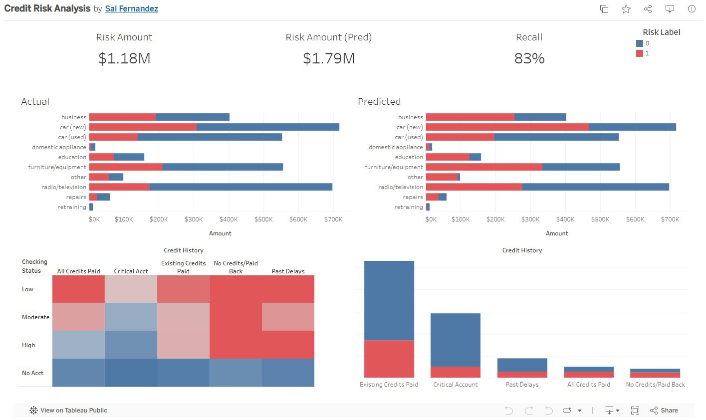
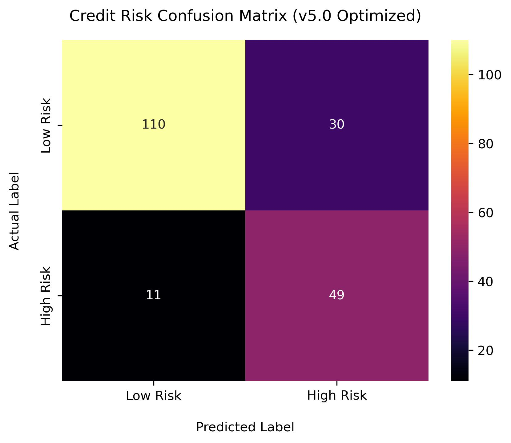
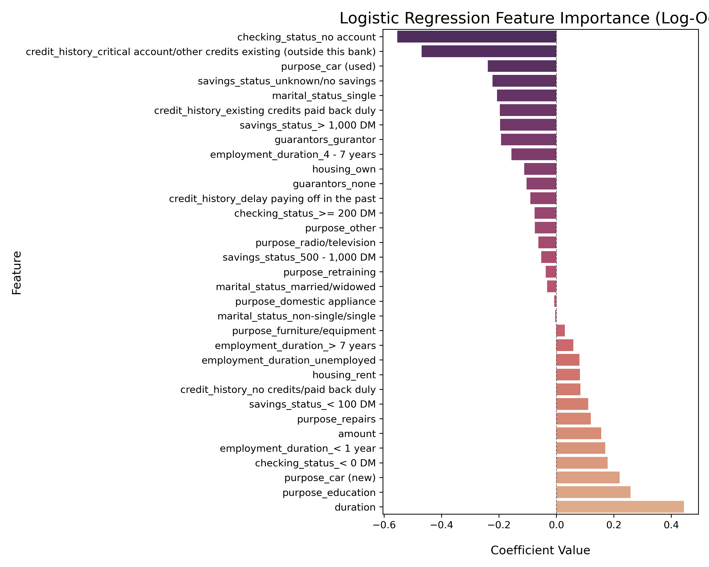
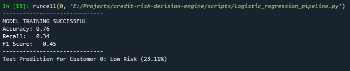
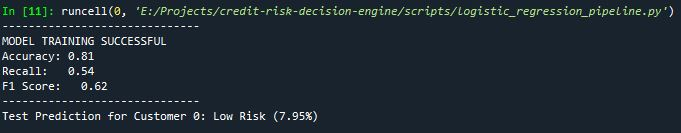
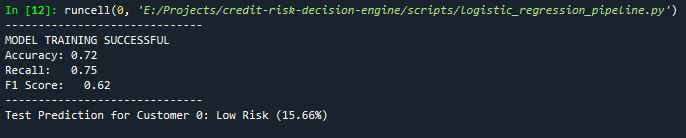
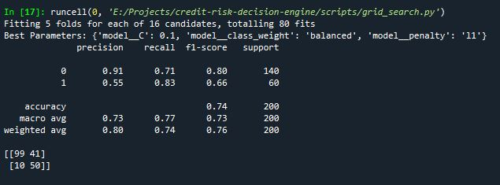
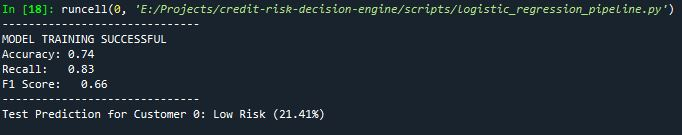

# Credit Risk Decision Engine

This project implements a full-stack machine learning pipeline to predict credit default risk using the German Credit Dataset. The engine is optimized to prioritize the identification of high-risk applicants, minimizing potential financial loss through rigorous hyperparameter tuning and a custom SQL-driven data pipeline.

**[🚀 Live Interactive App: https://credit-risk-engine-eulerlft.streamlit.app/](https://credit-risk-engine-eulerlft.streamlit.app/)**

## 🏗 Project Architecture & Workflow
The project is designed as a modular pipeline to ensure reproducibility and scalability:
1. <b>Data Staging (SQL/SQLite):</b> Raw data is ingested into an SQLite database via `load_data.py`, where SQL scripts handle schema creation and feature transformations.
2. <b>Exploratory Data Analysis (EDA):</b> A comprehensive analysis of 1,000 records to identify drivers of default and class imbalances. 
3. <b>Modeling Engine:</b> A Scikit-Learn pipeline utilizing Logistic Regression, optimized via `GridSearchCV` for maximum recall. 
4. <b>Deployment:</b> A real-time inference tool built with Streamlit for interactive risk assessment. 

## 📊 Business Intelligence (Tableau)
To provide stakeholders with a high-level view of the loan portfolio, I developed an interactive Tableau dashboard. This tool allows for the exploration of risk factors across different demographic and financial segments. \
**[View Interactive Dashboard on Tableau Public](https://public.tableau.com/app/profile/sal.fernandez/viz/CreditRiskAnalysis_17785991409790/CreditRiskAnalysis#1)** 



### Key Insights from the Analysis:
* **Risk Density:** Applicants with "no checking" accounts show a significantly higher density of high-risk labels compared to those with established credit.
* **Loan Purpose:** Credit requested for 'New Cars' and 'Education' requires stricter scrutiny, as these categories exhibit higher-than-average default rates in the historical data.
* **Duration Sensitivity:** Risk probability increases linearly with loan duration, peaking at terms longer than 36 months.

## Project Structure
```text
credit-risk-decision-engine/
├── assets/         # Performance screenshots and visualizations
├── data/           # Raw and cleaned datasets
├── scripts/        # Python modeling pipelines
├── sql/            # SQL transformations
├── models/         # machine-learning models 
├── README.md
└── requirements.txt
└── .gitignore
```

## 📊 Model Evolution & Performance
The final model (v5.0) was tuned to prioritize Recall, ensuring the bank captures the maximum number of true defaults.
The model successfully identifies 82% of all actual "High Risk" cases, providing a significant safety net against credit loss.

<p align="center">
  
</p>

### Feature Importance
The analysis reveals that Checking Account Status and Credit Duration are the most significant predictors of risk.

<p align="center">
  
</p>

### Performance Metrics 
| Model Version  | Strategy/Change | Accuracy | Recall | F1 | 
| -------- | -------- | -------- | -------- | -------- |
| v1.0 | Baseline (L1 regularization, C=0.05) | 0.76 | 0.34 | 0.45 |
| v4.0 | Balanced Weights | 0.72 | 0.75 | 0.62 |
| **v5.0** | **Grid Search Optimized** | **0.80** | **0.82** | **0.71** |

### Phase 1: Baseline Tuning (v1.0 - v3.0)
The first three versions focused on finding the right level of regularization. While v3.0 achieved the highest overall accuracy, the recall score was only 0.54, meaning the model was still missing nearly half of the high-risk applicants.
<details>
<summary>Click to view early iteration proofs</summary>

Versions 1.0 through 3.0 focused on finding regularization stability. While accuracy was high (~80%), the model missed too many defaults. \
<p align="center">
  
</p>
<p align="center">
  
</p>
</details>

### Phase 2: Prioritizing Risk Detection (v4.0)
By implementing `class_weight='balanced'`, we successfully shifted the model's focus to catching defaults, raising recall to 0.75. \
<details>
<summary>Click to view v4.0 iteration proofs</summary>
Versions 1.0 through 3.0 focused on finding regularization stability. While accuracy was high (~80%), the model missed too many defaults. \
<p align="center">
  
</p>
</details>


### Phase 3: Final Optimization (v5.0)
Using `GridSearchCV`, we mathematically identified the optimal C-value (0.1) and L1 penalty. This is our production engine. \

<p align="center">
  
</p>

<p align="center">
  
</p>


## Optimization & Methodology
The final model was selected using `GridSearchCV` to explore the hyperparameter space across multiple folds.
- Hyperparameter Tuning: Systematic testing of `C` strengths and `L1/L2` penalties identified `C=0.1` and `L1` as the optimal configuration for generalization.
- Data Leakage Prevention: Implemented a Scikit-Learn `Pipeline` to ensure that `StandardScaler` transformations were fitted exclusively on training folds during cross-validation.
- Class Imbalance: Applied `class_weight='balanced'` to ensure the model remained sensitive to the minority "High Risk" class.

## Optimized Output (v5.0)
### Usage
The core logic is contained within `logistic_regression_pipeline.py`. The `predict_risk` function allows for real-time inference on new applicant data using the optimized weights.
`from scripts.logistic_regression_pipeline import train_and_evaluate, predict_risk

# Train the optimized engine
model, cols, metrics = train_and_evaluate(df)

# Predict for a new applicant
result = predict_risk(new_applicant_data, model, cols)
print(f"Verdict: {result['verdict']} ({result['risk_probability']}%)")`

## 🛠 Tech Stack
- Database: SQLite, SQL (Complex Joins & View Creation)
- Analysis/ML: Python (Pandas, Scikit-Learn, Seaborn, Joblib)
- Deployment: Streamlit, Streamlit Cloud

## 🚀 Installation & Local Usage
To replicate this project locally:
1.  **Clone the Repository:**
    ```bash
    git clone https://github.com/EulerLft/credit-risk-decision-engine.git
    cd credit-risk-decision-engine
    ```

2. **Install Dependencies:**
    It is recommended to use a virtual environment:
    ```bash
    python -m venv venv
    source venv/bin/activate # On Windows use: venv\Scripts\activate
    pip install -r requirements.txt
    ```

3. **Run the Data Pipeline:**
    Execute the loading script to initialize the SQLite database and generate the cleaned dataset 
    ```bash
    python scripts/load_data.py
    ```

4. **Launch the Streamlit App:**
    ```bash
    streamlit run scripts/app_navigator.py
    ```

## Future Roadmap
- Web Interface: Implement a Streamlit dashboard for interactive risk assessment.
- Model Challenger: Evaluate Random Forest and XGBoost architectures against the Logistic Regression baseline.
- Feature Engineering: Incorporate non-linear transformations for loan amount and duration variables.